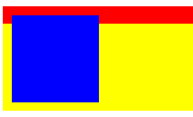
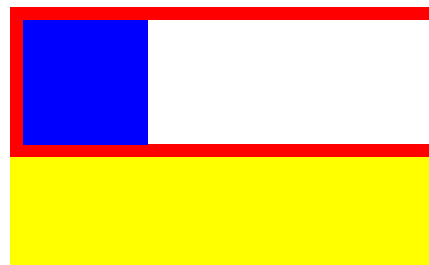
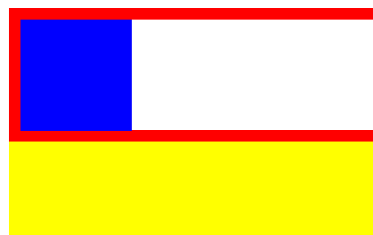
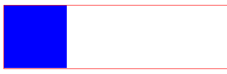
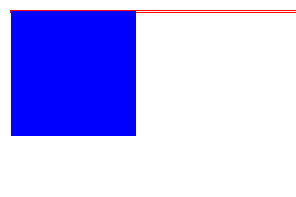

# 解决CSS高度塌陷问题

## 什么是高度塌陷

在文档流中，父元素的高度默认是被子元素撑开的，也就是子元素多高，父元素就多高。
但是当为子元素设置浮动以后，子元素会完全脱离文档流，
此时将会导致子元素无法撑起父元素的高度，导致父元素的高度塌陷。如：

```html
<!DOCTYPE html>
<html>
    <head>
        <meta charset="utf-8" />
        <title></title>
        <style type="text/css">
            .box1{
                /*为box1设置一个边框*/
                border: 10px red solid;
            }
            .box2{
                width: 100px;
                height: 100px;
                background-color: blue;
                /*为子元素设置向左浮动*/
                float: left;
            }
            .box3{
                height: 100px;
                background-color: yellow;
            }
        </style>
    </head>
    <body>
        <div class="box1">
            <div class="box2"></div>
        </div>
        <div class="box3"></div>
    </body>
</html>
```

打开该文件是这样的：



 由于父元素的高度塌陷了，则父元素下的所有元素都会向上移动，这样将会导致页面布局混乱。

## 怎么解决高度塌陷问题

## **①将父元素的高度写死。**

如：在父元素box1中加一个高度

```css
.box1{
    /*为box1设置一个边框*/
    border: 10px red solid;
    /*为父元素加一个高度*/
    height: 100px;
}
```



但是一旦高度写死，父元素的高度将不能自动适应子元素的高度，所以这种方案是不推荐使用的。

## **②开启元素BFC属性。**

根据W3C的标准，在页面中元素都一个隐含的属性叫做 `Block Formatting Context`
简称BFC，该属性可以设置打开或者关闭，默认是关闭的。
> 当开启元素的BFC以后，元素将会具有如下的特性：
 *     1.父元素的垂直外边距不会和子元素重叠
 *     2.开启BFC的元素不会被浮动元素所覆盖
 *     3.开启BFC的元素可以包含浮动的子元素

> 那如何开启元素的BFC呢？
 *     1.设置元素浮动：使用这种方式开启，虽然可以撑开父元素，但是会导致父元素的宽度丢失，而且使用这种方式也会导致下边的元素上移，不能解决问题
 *     2.设置元素绝对定位
 *     3.设置元素为inline-block：可以解决问题，但是会导致宽度丢失，不推荐使用这种方式
 *     4.将元素的overflow设置为一个非visible的值
 * 推荐方式：将overflow设置为hidden是副作用最小的开启BFC的方式。
 /*overflow: hidden;*/
但是在IE6及以下的浏览器中并不支持BFC，所以使用这种方式不能兼容IE6。
在IE6中虽然没有BFC，但是具有另一个隐含的属性叫做hasLayout，
该属性的作用和BFC类似，所在IE6浏览器可以通过开hasLayout来解决该问题
> 开启方式很多，我们直接使用一种副作用最小的：
直接将元素的zoom设置为1即可
 zoom表示放大的意思，后边跟着一个数值，写几就将元素放大几倍
 zoom:1表示不放大元素，但是通过该样式可以开启hasLayout
 zoom这个样式，只在IE中支持，其他浏览器都不支持。

```css
.box1{
    /*为box1设置一个边框*/
    border: 10px red solid;
    /*开启元素BFC属性*/
    overflow: hidden;
    /*IE6*/
    zoom:1;
}
```

看效果：



## **③可以直接在高度塌陷的父元素的最后，添加一个空白的div**

由于这个div并没有浮动，所以他是可以撑开父元素的高度的， 然后在对其进行清除浮动，这样可以通过这个空白的div来撑开父元素的高度，基本没有副作用。使用这种方式虽然可以解决问题，但是会在页面中添加多余的结构。

```html
<!DOCTYPE html>
<html>
    <head>
        <meta charset="UTF-8">
        <title></title>
        <style type="text/css">

            .box1{
                border: 1px solid red;
            }
            .box2{
                width: 100px;
                height: 100px;
                background-color: blue;
                float: left;
            }
            /*添加空白div*/
            .clear{
                clear: both;
            }
        </style>
    </head>
    <body>
        <div class="box1">
            <div class="box2"></div>
            <div class="clear"></div>
        </div>
    </body>
</html>
```

效果：



## **④通过after伪类，选中box1的后边**

可以通过after伪类向元素的最后添加一个空白的块元素，然后对其清除浮动，这样做和添加一个div的原理一样，可以达到一个相同的效果，而且不会在页面中添加多余的div，这是最推荐使用的方式，几乎没有副作用。
但是，在IE6中不支持after伪类, 所以在IE6中还需要使用hasLayout来处理。

```html
<!DOCTYPE html>
<html>
    <head>
        <meta charset="UTF-8">
        <title></title>
        <style type="text/css">

            .box1{
                border: 1px solid red;
            }

            .box2{
                width: 100px;
                height: 100px;
                background-color: blue;

                float: left;
            }


            .clearfix:after{
                /*添加一个内容*/
                content: "";
                /*转换为一个块元素*/
                display: block;
                /*清除两侧的浮动*/
                clear: both;
            }


            .clearfix{
                zoom:1;
            }


        </style>
    </head>
    <body>
        <div class="box1">
            <div class="box2"></div>
        </div>
    </body>
</html>
```

效果：



总结
开发中，如果有父元素和子元素且子元素会浮动的情况下，就要注意高度塌陷问题并解决。

选用最优解决办法：

```css
.clearfix:after{
    /*添加一个内容*/
    content: "";
    /*转换为一个块元素*/
    display: block;
    /*清除两侧的浮动*/
    clear: both;
}
```
