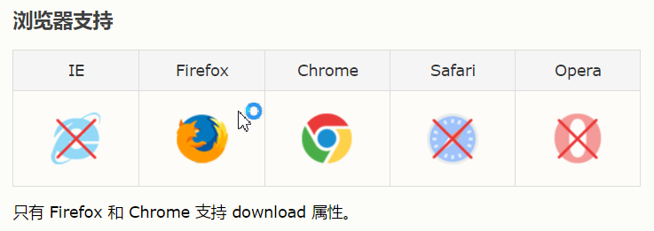
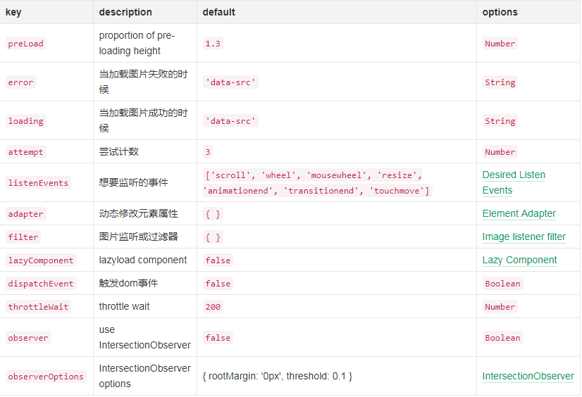
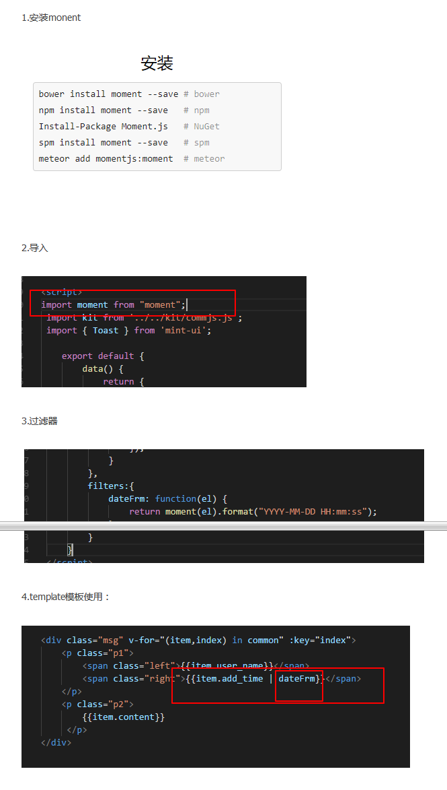

## 1、创建项目
`yarn create nuxt-app xxx(注：文件名)`

```
> Generating Nuxt.js project in F:\xxx(注：文件名)
? Project name xxx(注：文件名)
? Project description My badass Nuxt.js project
? Use a custom server framework none
? Choose features to install (Press <space> to select, <a> to toggle all, <i> to
? Choose features to install (Press <space> to select, <a> to toggle all, <i> to
? Choose features to install (Press <space> to select, <a> to toggle all, <i> to
? Choose features to install (Press <space> to select, <a> to toggle all, <i> to
? Choose features to install (Press <space> to select, <a> to toggle all, <i> to

 invert selection)
? Use a custom UI framework ant-design-vue
? Use a custom test framework none
? Choose rendering mode Universal
? Author name tianmengmeng
? Choose a package manager yarn

  To get started:

        cd xxx(注：文件名)
        yarn run dev

  To build & start for production:

        cd xxx(注：文件名)
        yarn run build
        yarn start

Done in 292.52s.
```

## 2、请求接口（`https://axios.nuxtjs.org/setup`）
```
使用axios
yarn add @nuxtjs/axios
或者npm install @nuxtjs/axios

配置文件nuxt.config.js

module.exports = {
  
modules: [
    '@nuxtjs/axios',
  ],

axios: {
    // proxyHeaders: false
  }

}
```
> 封装公共api(可用、重点)，参考 [https://segmentfault.com/a/1190000010815403](https://segmentfault.com/a/1190000010815403)

## 3、[Nuxt使用Vuex](./Nuxt使用Vuex.md)

参考网址：

[https://zh.nuxtjs.org/](https://zh.nuxtjs.org/)

[https://nextjs.org/docs/](https://nextjs.org/docs/)

## 4.代码高亮
http://binlive.cn/vue

## 5.UI框架
有赞UI框架：
https://youzan.github.io/vant/#/zh-CN/intro

vue版本的antd
https://vuecomponent.github.io/ant-design-vue/docs/vue/introduce-cn/

iview框架
https://www.iviewui.com/components/carousel

打包遇到的问题(参考)
https://segmentfault.com/q/1010000004929368/a-1020000004929613/revision

## 6.webpack3不支持`-webkit-box-orient:vertical`

问题：

css3样式超出两行隐藏
```
  overflow:hidden;
  text-overflow:ellipsis;
  display:-webkit-box;
  -webkit-box-orient:vertical;
  -webkit-line-clamp:2;
```
在webpack3不起效果，-webkit-box-orient:vertical不会被编译

解决办法：
```
  overflow:hidden;
  text-overflow:ellipsis;
  display:-webkit-box;
  /* autoprefixer: off */
  -webkit-box-orient:vertical;
  /* autoprefixer: on */
  -webkit-line-clamp:2;
```
> 原因：
> autoprefixer不仅会帮你加-webkit-之类的prefixer，还会删除css中的样式，用注释包裹就不会被删除

## 7.Vue中获取dom元素
Vue.js虽然说是数据驱动页面的，但是有时候我们也要获取dom对象进行一些操作。

vue的不同版本获取dom对象的方法不一样

Vue.js  1.0版本中，通过v-el绑定，然后通过this.els.XXX来获取

Vue.js  2.0版本中。我们通过给元素绑定ref=“XXX”，然后通过this.$refs.XXX或者this.refs['XXX']来获取

以2.0为例：
```
<template>
  <section>
    <div ref="hello">
      <h1>Hello World ~</h1>
    </div>
    <el-button type="danger" @click="get">点击</el-button>
  </section>
</template>
<script>
  export default {
    methods: {
      get() {
        console.log(this.$refs['hello']);
        console.log(this.$refs.hello);
      }
    }
  }
</script>
```
<h3 style="color: red;">vue中操作dom需要谨慎，尤其是添加或删除dom的时候，
特别是mounted()和created()的时候，此时dom对象还没有生成，要放在this.nextTick()的回调函数中。</h3>
http://www.cnblogs.com/jin-zhe/p/9985151.html

## 8.a标签实现文件下载

如果想通过纯前端技术实现文件下载，直接把a标签的href属性设置为文件路径即可，如下：

```
<a href="https://cdn.shopify.com/s/files/1/1545/3617/files/SH01_User_Manaul.pdf">download</a>
```

但是，对于 txt , jpg , pdf 等浏览器支持直接打开的文件不会被执行下载，而是会直接打开，这时候一个新属性就要上场了--【download】

```
<a href="https://cdn.shopify.com/s/files/1/1545/3617/files/SH01_User_Manaul.pdf" download="test.pdf">download</a>
```

download属性不止可以实现下载，其属性值还可以规定下载时的文件名，如果不填写，会自动使用默认文件名。



很遗憾，兼容性不佳，本人实际测试结果也同上图一致。但是，虽然不兼容，但不代表完全不支持，IE 和 Safari 不会直接下载，但是会有下载提示框弹出，只是多绕了一步而已。如果不想借助后台而要实现文件下载，给a标签加download绝对是首选之策。

另外，我们还可以通过js判断浏览器的兼容性去选择性给用户一些提示信息。
```
<script>
    var supportDownload = "download" in document.createElement("a");
    if(!supportDownload){
      // code...
    }
</script>
```

## 9.Vue项目中实现图片懒加载（参数参考 https://blog.csdn.net/twodogya/article/details/80223331）

对于图片过多的页面，为了加速页面加载速度，所以很多时候我们需要将页面内未出现在可视区域内的图片先不做加载， 等到滚动到可视区域后再去加载。这样子对于页面加载性能上会有很大的提升，也提高了用户体验。

实现方法(使用vue的vue-lazyload插件)

1. 安装插件
```
yarn add vue-lazyload
```
或者
```
npm install vue-lazyload --save-dev
```

2. 在入口文件main.js中引入并使用(Vue使用)
```
import VueLazyload from 'vue-lazyload'
```
直接使用
```
Vue.use(VueLazyload)
```
或者添加自定义选项
```
Vue.use(VueLazyload, {
  preLoad: 1.3,
  error: 'dist/error.png',
  loading: 'dist/loading.gif',
  attempt: 1
})
```
**在plugins文件夹下新建vue-lazyload.js文件(Nuxt使用)**

内容：
```
import Vue from 'vue'
import VueLazyload from 'vue-lazyload'

export default () => {
  Vue.use(VueLazyload, {
    preLoad: 1.3,
    // error: 'dist/error.png',
    // loading: 'dist/loading.gif',
    error: require('../static/placeholder.png'),
    loading: require('../static/placeholder.png'),
    attempt: 1
  })
}
```
```
// nuxt.config.js中配置：
 /*
  ** Plugins to load before mounting the App
  */
  plugins: [
    '@/plugins/vue-lazyload'
  ],
```
3. 修改图片显示方式为懒加载（将 :src 属性直接改为v-lazy）
```
<a href="javascript:;">
  
  // 若为静态
  
</a>
```
参数选项说明




## 10.处理时间：例如把后台传来的日期时间转化为几天前,几小时前，几分钟前在前端展现
```
timeago("2018-10-22 20:52:23");
function timeago(nowDateTimeStamp) {
  var dateTimeStamp = (new Date(Date.parse(nowDateTimeStamp.replace(/-/g, "/")))).getTime();
  var result;

  // dateTimeStamp是一个时间毫秒，注意时间戳是秒的形式，在这个毫秒的基础上除以1000，就是十位数的时间戳。13位数的都是时间毫秒。
  var minute = 1000 * 60;      //把分，时，天，周，半个月，一个月用毫秒表示
  var hour = minute * 60;
  var day = hour * 24;
  var week = day * 7;
  var halfamonth = day * 15;
  var month = day * 30;

  var now = new Date().getTime();   //获取当前时间毫秒
  var diffValue = now - dateTimeStamp;//时间差

  if (diffValue < 0) { return; }

  var minC = diffValue / minute;  //计算时间差的分，时，天，周，月
  var hourC = diffValue / hour;
  var dayC = diffValue / day;
  var weekC = diffValue / week;
  var monthC = diffValue / month;

  if (monthC >= 1) {
    if (monthC >= 3) {
      result = nowDateTimeStamp.slice(0,10);
      return result;
    }
    result = "" + parseInt(monthC) + "月前";
  }
  else if (weekC >= 1) {
    result = "" + parseInt(weekC) + "周前";
  }
  else if (dayC >= 1) {
    result = "" + parseInt(dayC) + "天前";
  }
  else if (hourC >= 1) {
    result = "" + parseInt(hourC) + "小时前";
  }
  else if (minC >= 1) {
    result = "" + parseInt(minC) + "分钟前";
  } else {
    result = "刚刚";
  }
  return result;
}
```

## 11.包含富文本编辑器

参考网址（https://www.cnblogs.com/laozhang-is-phi/p/10249248.html）

博客代码（https://github.com/anjoy8/Nuxt.tBug/blob/master/pages/details/_id.vue）

nuxt相关博客（https://www.bbsmax.com/R/KE5QXeK4JL/）

## 12、微信小程序课程表（https://github.com/qq273681448/TimeTable）

## 13.查看该网站使用了什么技术（https://www.wappalyzer.com/）

## 14.前端参考网站（https://www.jianshu.com/p/53a7da454057）

## 15.js上拉加载下拉刷新
（http://www.mescroll.com/）
（https://github.com/mescroll/mescroll）
滚动加载（https://www.jianshu.com/p/9101e971cafd）

## 16.nuxt中get-window（https://nuxtjs.org/api/nuxt-render-and-get-window）

## 17.nuxt 登录权限验证demo

（详解：https://blog.csdn.net/weixin_43731904/article/details/84778439，
  代码：https://github.com/liuzhumin/nuxt-demo）
参考2：
https://blog.csdn.net/umufeng/article/details/80524766

## 18.404重定向（https://segmentfault.com/q/1010000016847108）

## 19.如何在vue项目中使用md5加密

npm安装：
`npm install --save js-md5`

1. 在需要使用的项目文件中引入：
`import md5 from 'js-md5';`

使用：
```
md5('holle')  // bcecb35d0a12baad472fbe0392bcc043
```
2. 或者在main.js文件中将md5转换成vue原型：
```
import md5 from 'js-md5';
Vue.prototype.$md5 = md5;
```

## 20、监听路由变化
```
watch: {
    $route: {
      handler: function(val, oldVal){
        console.log('当前',val ? val.path : '空');
        console.log('历史',oldVal ? oldVal.path : '空');
      },
      immediate: true,//字符串监听
      // deep: true,// 深度观察监听
    }
  }
```
## 21.[nuxt.js中间件实现拦截权限判断的方法](./nuxt.js中间件实现拦截权限判断的方法.md)

## 22.加载更多
```
npm install --save reqwest vue-infinite-scroll vue-virtual-scroller
// 或者
yarn add reqwest vue-infinite-scroll vue-virtual-scroller
```

## 23.reqwest请求数据
```
methods: {
   fetchData(callback) {
      const _this = this;
      reqwest({
        url: "http://v2.xxx.cn/recommend/getListByPage",
        type: "json",
        method: "post",
        // contentType: 'application/json',//get用
        contentType: "application/x-www-form-urlencoded",//post
        data: {
          page: 1,
          pagesize: 8,
          recommendableType: "article"
        },
        success: res => {
          console.log("res", res);
          _this.count = res.result.count;
          callback(res);
        }
      });
    }
}
```
## 24.nuxt配置404

直接layouts文件夹下加error.vue，定制自己想要的错误页面
```
  <template>
    <div>
      <h2 v-if="error.statusCode == 404">404页面不存在</h2>
      <h2 v-else>500服务器错误</h2>
      <nuxt-link to="/">返回首页</nuxt-link>
    <div>
  </template>
  <script>
    export default {
        props: ['error']
    }
  </script>
```
当不存在当前页面时 会自动跳转

如果需要检验动态参数,可以在目的页面validate（）方法里判断，也可以路由中间件中判断手动处理，比如我这边的多语言，输入不存在的多语言，也希望跳转404页面，可以在中间件写入
```
if (store.state.locales.indexOf(locale) === -1) {
    return error({
      message: 'This language could not be found.',
      statusCode: 404
    })
  }
```

## 25.iview ui框架（https://www.iviewui.com/docs/guide/start）
安装iview和按需加载：yarn add babel-plugin-import iview

## 26.nuxt踩坑指南
https://segmentfault.com/a/1190000014526984?utm_source=channel-hottest

## 27.递归渲染评论
[Vue一个案例引发的递归组件的使用](./Vue一个案例引发的递归组件的使用.md)

## 28.下载vue扩展工具（快速出现调试面板，在url后面输入参数：#CSP-environments）
[解决vue-devtools在Chrome中无效问题终极方案](./解决vue-devtools在Chrome中无效问题终极方案.md)
https://www.jianshu.com/p/a8cda3388854

## 29.Autoprefixer applies control comment to whole block, not to next rules.

vue nuxt中多行文本省略号如下写，会报`Warning:Autoprefixer applies control comment to whole block, not to next rules.`
```
.wrap{
    overflow: hidden;
    text-overflow: ellipsis;
    display: -webkit-box;
    -webkit-line-clamp: 2;
    /* autoprefixer: off */
    -webkit-box-orient: vertical;
    /* autoprefixer: on */
}
```
此时需修改成：
```
/* autoprefixer: ignore next */
-webkit-box-orient: vertical;
```
意思是让单行(而不是块)的规则需要用 autoprefixer: ignore next

## 30.[vue tab滚动到一定高度,固定在顶部,点击tab切换不同的内容](./vue点击tab切换不同的内容.md)


## 31.[随鼠标晃动的小女孩](https://www.cnblogs.com/chengxiang123/p/9214641.html)

## 32.多个layout

**[layout 属性](https://zh.nuxtjs.org/api/pages-layout/)**

## 33.[nuxt使用QRCode.js 生成二维码](./nuxt使用QRCode.js生成二维码.md)

[官方文档](http://code.ciaoca.com/javascript/qrcode/)

解决渲染多次的bug

> 参考：
> [https://blog.csdn.net/liuy_1314/article/details/83109360](https://blog.csdn.net/liuy_1314/article/details/83109360)<br/>
> 重点：`document.getElementById("qrcode").innerHTML = "";`

## 34.[QQ空间、新浪微博、腾讯微博等一键分享API链接代码](./QQ空间、新浪微博、腾讯微博等一键分享API链接代码.md)

## 35.markdown编辑器 
api地址[https://github.com/hinesboy/mavonEditor](https://github.com/hinesboy/mavonEditor)
参考：[https://www.jianshu.com/p/04376d0c9ff1](https://www.jianshu.com/p/04376d0c9ff1)

## 36.判断数组中是否存在该项，存在则删除，不存在则添加
[vue中传多选项数据到后台（判断数组中是否存在该项，存在则删除，不存在则添加）](./vue中传多选项数据到后台.md)

## 37.NUXT跳坑指南https://www.jianshu.com/p/840169ba92e6

## 38.轮子工厂（各种插件）
http://www.wheelsfactory.cn/#/home?filter=vue

## 39.拖拽
采用[https://github.com/SortableJS/Vue.Draggable](https://github.com/SortableJS/Vue.Draggable)

## 40.Vue系列：滚动页面到指定位置
方法1：scrollTop 滚动到某位置
```
// 不需要加单位，直接这句话就可以实现滚动到某位置
document.documentElement.scrollTop = 380;
```
方法2：scrollTo，scrollBy，scroll滚动到某位置
```
// 第一个坑，ref绑定的元素不能是display:none
// 第二要加上this.nextTick
this.$nextTick(() => {
  this.$refs.DOM.scrollTo(0, 380);
})
```
方法3：scrollIntoView() 实现滚动到具体某元素
```
document.getElementById("ID").scrollIntoView();
```
需注意，上述3种方法都不是平滑滚动

## 41.JS数字计算精度误差的解决方法
为了避免产生精度差异，我们要把需要计算的数字乘以 10 的 n 次幂，换算成计算机能够精确识别的整数，然后再除以 10 的 n 次幂，大部分编程语言都是这样处理精度差异的，我们就借用过来处理一下 JS 中的浮点数精度误差。
```
formatNum = function(f, digit) { 
    var m = Math.pow(10, digit); 
    return parseInt(f * m, 10) / m; 
} 

　var num1 = 0.1; 
　var num2 = 0.2;
　alert(formatNum(num1 + num2, 1) === 0.3);
```

## 42.图片居中显示
参考张鑫旭博客
[https://www.zhangxinxu.com/wordpress/2015/03/css3-object-position-object-fit/](https://www.zhangxinxu.com/wordpress/2015/03/css3-object-position-object-fit/)

**object-fit**的其它值
那么**object-fit**属性还有哪些值呢？
```
　　object-fit: fill;
　　object-fit: contain;
　　object-fit: cover;
　　object-fit: none;
　　object-fit: scale-down;
```

**fill**: 中文释义“填充”。默认值。替换内容拉伸填满整个contentbox,不保证保持原有的比例。
**contain**: 中文释义“包含”。保持原有尺寸比例。保证替换内容尺寸一定可以在容器里面放得下。因此，此参数可能会在容器内留下空白。
**cover**: 中文释义“覆盖”。保持原有尺寸比例。保证替换内容尺寸一定大于容器尺寸，宽度和高度至少有一个和容器一致。因此，此参数可能会让替换内容（如图片）部分区域不可见（上面讲解的例子就是如此）。
**none**: 中文释义“无”。保持原有尺寸比例。同时保持替换内容原始尺寸大小。
**scale-down**: 中文释义“降低”。就好像依次设置了none或contain, 最终呈现的是尺寸比较小的那个

## 43.如何发布自己模块到NPM
[https://www.jianshu.com/p/f5d4c891830f](https://www.jianshu.com/p/f5d4c891830f)

## 44.nuxt相关
[https://gitbook.cn/books/5b45a9d28a13f874b900d302/index.html](https://gitbook.cn/books/5b45a9d28a13f874b900d302/index.html)

## 45.[互联网职称缩写](./互联网职称缩写.md)

## 46.vue省市区三级联动插件(v-distpicker)
官网：[https://www.npmjs.com/package/v-distpicker](https://www.npmjs.com/package/v-distpicker)

## 47.腾讯地图取key值
[https://lbs.qq.com/console/user_info.html](https://lbs.qq.com/console/user_info.html)

## 48.第三方登录：
微信：[https://open.weixin.qq.com/cgi-bin/showdocument?action=dir_list&t=resource/res_list&verify=1&id=open1419316505&token=&lang=zh_CN](https://open.weixin.qq.com/cgi-bin/showdocument?action=dir_list&t=resource/res_list&verify=1&id=open1419316505&token=&lang=zh_CN)

QQ登录：[http://wiki.open.qq.com/wiki/website/JS_SDK%E4%BD%BF%E7%94%A8%E8%AF%B4%E6%98%8E#1._.E5.AE.9E.E7.8E.B0QQ.E7.99.BB.E5.BD.95.E5.8A.9F.E8.83.BD](http://wiki.open.qq.com/wiki/website/JS_SDK%E4%BD%BF%E7%94%A8%E8%AF%B4%E6%98%8E#1._.E5.AE.9E.E7.8E.B0QQ.E7.99.BB.E5.BD.95.E5.8A.9F.E8.83.BD)

新浪微博登录：[https://open.weibo.com/wiki/Connect/login](https://open.weibo.com/wiki/Connect/login)

## 49.QQface表情
[https://www.npmjs.com/package/vue-qqface](https://www.npmjs.com/package/vue-qqface)

## 50.[iview表格table中，如何添加Dropdown下拉菜单](./iview表格table中添加Dropdown下拉菜单.md)

## 51.[小生方勤-分享8个有趣且实用的API](https://juejin.im/post/5c92446b6fb9a070c022f0e2)

## 52.[有关使用 iview 表单验证的问题](https://www.cnblogs.com/s-qiu/p/8041603.html)

- 由于async-validator默认只验证String类型的，所以才导致的验证不起作用的问题。
- Vue的UI解决框架，element-UI， iview-UI 有关表单验证使用的是同一个插件，async-validator，有关这个插件的用法就不做赘述，但是在iview表单的使用中可能会用到验证不起作用的问题，原因是给表单绑定的value是id或者type，value等Number类型的值，多见于select下拉框，这时，由于async-validator默认只验证String类型的，所以才导致的验证不起作用的问题，解决方案：async-validator支持正则验证，加上正则后自动将要验证的字段值转为String类型
```
id: [
　　{required: true, message: '请选择', pattern: /.+/, trigger: 'change'}
]
```
> 可以看到，加红部分，是一个正则表达式，匹配所有非空值

## 53.[数组去重](./数组去重.md)

## 54.vue常用事件之`v-on:click`以及事件对象，事件冒泡，事件默认行为
[v-on:click以及事件对象，事件冒泡，事件默认行为](./v-onclick.md)

## 55.vue中vue-lazyload插件loading图展示不出来，前面再加一个src
```

```

## 56.vue动态获取浏览器内容高度并赋值给元素

用到的是vue  style绑定    其中   `v-bind=:`

以下是代码
```
<template>
  <div class="hello">
  　　<div  :style="height"></div>
  </div>
</template>
<script>
  export default {
    name: 'hello',
    data () {
    　　return {
    　　　　height:{
    　　　　　　width:'200px',
    　　　　　　height:'',
    　　　　　　backguound:#ccc,
    　　　　}
    　　}
    },
    components:{
    },
    created(){
    　　this.hh()
    },
    methods:{
    　　hh(){
          this.height.height=window.innerHeight-153+'px';
    　　}
    }
  }
</script>
```
## 57.iview modal 怎样 控制 对话框的 不关闭
想要使用 iview 的 Modal对话框实现 单击确定的 时候不直接关闭对话框，而是经过一些判断，

满足自己的条件的时候再关闭对话框

可以使用iview的 slot 自定义样式实现
```
<div slot="footer">
     <Button type="text" size="large" @click="modalCancel">取消</Button>
     <Button type="primary" size="large" @click="modalOk">确定</Button>
</div>
```

## 58.45个值得收藏的 CSS 形状
https://www.jianshu.com/p/b8b81254ece8

## 59.nuxt的loading
http://www.cnblogs.com/buzhiqianduan/p/7922525.html

## 60.m3u8视频播放参考
https://yq.aliyun.com/articles/613818#

## 61.视频播放bug
https://www.cnblogs.com/tinywan/p/6692098.html

解决video标签播放m3u8格式视频失败问题
https://blog.csdn.net/m0_38082783/article/details/82148862

## 62.七牛云处理视频sdk
http://jssdk.demo.qiniu.io/

七牛云JavaScript SDK
https://developer.qiniu.com/kodo/sdk/1283/javascript#2
请求成功之后返回值：https://developer.qiniu.com/dora/manual/1294/persistent-processing-status-query-prefop（持久化上传参考）：
{hash: "FmHLx9NU6iu73Wps85f10aFLGPPK", key: "adv.mp4", persistentId: "z0.5cef99ff38b9f31ea6a0036c"}
使用get请求https://api.qiniu.com/status/get/prefop?id=z0.5cefa4f638b9f31ea6af8bf1（id为persistentId）

http://jssdk.demo.qiniu.io/

## 63.vue 七牛云上传文件步骤及问题汇总
https://www.jianshu.com/p/b28fbab95b5a

## 64.VUE 复制内容至剪切板(两种使用方法)
复制内容至剪切板使用的是插件`vue-clipboard2`,通过官方文档[https://www.npmjs.com/package/vue-clipboard2](https://www.npmjs.com/package/vue-clipboard2)会发现共有两种使用方式。 
第一种方式与大多数文章类似，只粘贴代码：
```
<template>
  <div class="container">
    <input type="text" v-model="message">
    <button type="button"
            v-clipboard:copy="message"
            v-clipboard:success="onCopy"
            v-clipboard:error="onError">Copy!</button>
  </div>
</template>
<script>
  export default {
    data() {
      return {
        message: 'Copy These Text',
      }
    },
    methods: {
      onCopy: function (e) {
        alert('You just copied: ' + e.text)
      },
      onError: function (e) {
        console.log(e)
        alert('Failed to copy texts')
      }
    }
  }
</script>
```
这种使用方式直接将变量内容复制至剪切板，暂时没有找到处理数据后再复制的方式，这时就需要使用第二种方式。

第二种方式：
```
<template>
  <div class="container">
    <input type="text" v-model="message">
    <button type="button" @click="doCopy('add me!')">Copy!</button>
  </div>
</template>
<script>
  export default {
    data() {
      return {
        message: 'Copy These Text'
      }
    },
    methods: {
      dataProcessing (val) {
        this.message = this.message + ' ' + val
      },
      doCopy: function (val) {
        this.dataProcessing(val)
        this.$copyText(this.message).then(function (e) {
          alert('Copied')
          console.log(e)
        }, function (e) {
          alert('Can not copy')
          console.log(e)
        })
      }
    }
  }
</script>
```
通过这段示例代码能看到，复制动作使用的是VUE响应函数方式，这就为复制前控制数据提供了可能！

## 65.最新正则校验手机号
`
(/^[1](([3][0-9])|([4][5-9])|([5][0-3,5-9])|([6][5,6])|([7][0-8])|([8][0-9])|([9][1,8,9]))[0-9]{8}$/).test('17739166704')
`

## 66.vue时间戳格式化插件
[http://momentjs.cn/](http://momentjs.cn/)


## 67.vue项目里登录界面实现回车登录
全局监听enter键，是把监听事件绑定到document上，无需获取焦点之类的
```
created() {
    let that = this;
    document.onkeydown =function(e){
      e = window.event || e;
      if(that.$route.path=='/login'&&(e.code=='Enter'||e.code=='enter')){//验证在登录界面和按得键是回车键enter
        that.submitForm('loginForm');//登录函数
      }
    }
  }
```

## 68.[Vue模块化，封装Storage组件实现保存搜索的历史记录](./封装Storage组件实现保存搜索的历史记录.md)

## 69.[atom快捷键](https://www.cnblogs.com/hubgit/p/5130192.html)

## 70.[网站测评](http://www.mmtrix.com/evaluate/applist#)

## 71.nuxt中怎么使用keep-alive,或者怎么缓存上一页的信息
[https://github.com/nuxt/nuxt.js/tree/dev/examples/with-keep-alive](https://github.com/nuxt/nuxt.js/tree/dev/examples/with-keep-alive)

## 72.Nuxt项目搭建与接口API
[https://www.cnblogs.com/laozhang-is-phi/p/10249248.html](https://www.cnblogs.com/laozhang-is-phi/p/10249248.html)

## 73.vue SSR指南
[https://ssr.vuejs.org/zh/guide/caching.html#%E9%A1%B5%E9%9D%A2%E7%BA%A7%E5%88%AB%E7%BC%93%E5%AD%98-page-level-caching](https://ssr.vuejs.org/zh/guide/caching.html#%E9%A1%B5%E9%9D%A2%E7%BA%A7%E5%88%AB%E7%BC%93%E5%AD%98-page-level-caching)

## 74.nuxt缓存
https://juejin.im/post/5b2b62096fb9a00e61494b0b
参考：
https://ssr.vuejs.org/zh/guide/caching.html#%E7%BB%84%E4%BB%B6%E7%BA%A7%E5%88%AB%E7%BC%93%E5%AD%98-component-level-caching
nuxt缓存实践：
https://juejin.im/post/5b2b62096fb9a00e61494b0b#heading-3

## 75.[js中判断数组中是否包含某元素的方法](./js中判断数组中是否包含某元素的方法.md)

## 76.[掘金大牛博客](https://surmon.me/vlog)
[掘金大牛对于Nuxt的看法](https://juejin.im/post/58ff960ba22b9d0065b722cd)

## 77.Ant Design使用了getFieldDecorator不可以设置默认值解决办法
Ant Design使用了getFieldDecorator不可以设置默认值，不使用又无法通过表单获取值，简直尴尬的一匹，比如我们在getFieldDecorator中设置了defaultValue或者value就会报如下错：

运行的代码：
```
getFieldDecorator('name', {
  rules: [{ required: true, message: '请输入姓名!' }],
})(
  <Input defaultValue="测试" value="测试" />,
)}
```
报错如下：
```
Warning: `getFieldDecorator` will override `value`, so please don't set `value` directly and use `setFieldsValue` to set it.
```
根据提示getFieldDecorator会修改value和defaultValue

解决办法
在getFieldDecorator中需要用initalValue来设置值
```
{getFieldDecorator('name', {
  rules: [{ required: true, message: '请输入姓名!' }],
  initialValue: "你设置的默认值",
})(
  <Input />,
)}
```
## 78.提高安全性的最佳 Nginx 配置
https://learnku.com/articles/9485/the-best-nginx-configuration-for-improving-security
Cross-Origin Read Blocking (CORB)（解决跨域）
https://juejin.im/post/5cc2e3ecf265da03904c1e06