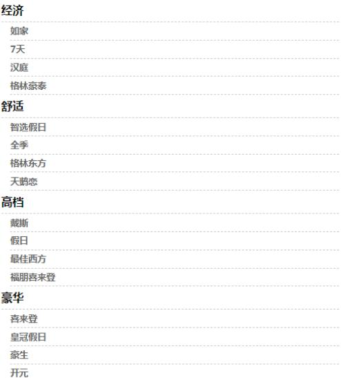
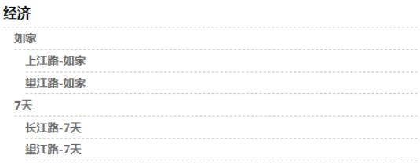

# Vue一个案例引发的递归组件的使用

**信息的分类展示列表**

这次我们主要是实现一个信息的分类展示列表存在二级/三级的分类，如下如所示：



看到这个很多人会想到这个实现起来很简单啊，来个嵌套循环不就完事了。

对，你说的没错，事实就是这样简单。那么就先来看看这么简单的列表怎么实现的，然后这个方案的劣势在哪里。

首先看看我们的数据格式
```
list: [{
    name: "经济",
    children: [{
        name: "如家"
    }, {
        name: "7天"
    }]
}, {
    name: "舒适",
    children: [{
        name: "智选假日"
    }, {
        name: "全季"
    }]
}]
```

基于上面的数据格式，我们的实现方式如下：
```
<div class="list-item" v-for="(item, index) in list" :key="index">
  <div class="item-name">
    <span>{{item.name}}</span>
  </div>
  <div v-if="item.children" class="children-item">
    <div v-for="(child, index) in item.children" :key="index">
      <div class="item-name">
        <span>{{child.name}}</span>
      </div>
    </div>
  </div>
</div>
```

嗯，看上去非常完美，我们的列表也非常好的展现出来，大功告成。

可是突然有一天咱们的产品突然跑过来说，我们的数据现在多加了一级分类，现在变成这样子了。
```
list: [{
    name: "经济",
    children: [{
        name: "如家",
        children: [{
            name: "长江路-如家"
        }, {
            name: "望江路-如家"
        }]
    }, {
        name: "7天",
        children: [{
            name: "长江路-7天"
        }, {
            name: "望江路-7天"
        }]
    }]
}]
```

好吧，既然产品有需求数据有变化，那么我们就改代码吧，于是我们在原有的代码上继续加上一层嵌套循环，这次又总算完成了，但是可能没过两天我们的数据又增加了一级分类怎么办？还是继续嵌套下去？

有些同学可能就会觉得了，哪有这么多层级的数据展示，肯定不会存在的，那只能说我们太年轻，我们不排除这种存在的可能，那如果我们遇到这种情况怎么办？这里就要用到我们说的 递归组件 了，无论你的数据怎么增加我们都不用改动我们的代码。

**递归组件**

什么是递归组件？简单来说就是在组件中内使用组件本身，下面我们就来看看如何在项目中使用递归组件去解决我们上面问题。

首先我们先创建一个 List 的递归组件
```
<template>
    <div>
        <div class="list-item" v-for="(item, index) in list" :key="index">
            <div class="item-name">
                <span>{{item.name}}</span>
            </div>
            <div v-if="item.children" class="children-item">
                <list :list="item.children"></list>
            </div>
        </div>
    </div>
</template>
<script>
    export default {
    name: "List",
    props: {
        list: Array
    }
    };
</script>
```
注意上面的代码中我们使用了 List 组件本身，完成这些之后，我们在外部父级组件中使用 List 组件时，不管我们的数据有多少层嵌套关系，都可以完美的自适应加载，我们再也不用通过嵌套嵌套在嵌套了。
```
<template>
    <div class="list-detail">
      <list :list="list"></list>
    </div>
</template>
<script>
import List from "./components/List";
export default {
  name: "Parent",
  components: { List },
  data() {
    return {
      list: [{
          name: "经济",
          children: [{
              name: "如家",
              children: [{
                  name: "上江路-如家"
                },
                {
                  name: "望江路-如家"
                }]
            },{
              name: "7天",
              children: [{
                  name: "长江路-7天"
                },
                {
                  name: "望江路-7天"
                }]
            }]
        }]
    }
  }
}
</script>
```
最后我们来看看渲染后的结果



**总结**

如上就是我们今天要说的递归组件，小伙伴们赶紧上手试试吧。

类似与信息分类的展示在我们的项目中是非常常见的形式，我们利用递归组件可以很好的去解决问题