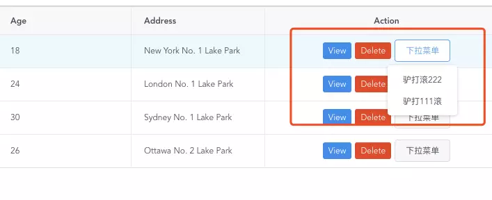
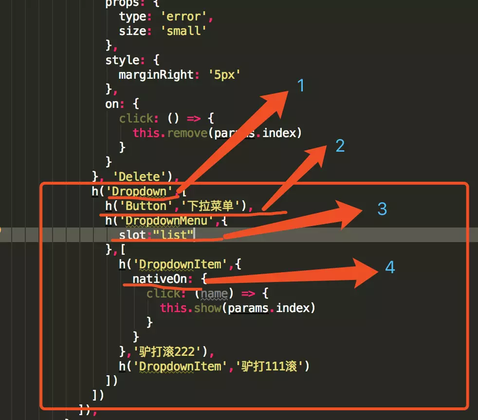
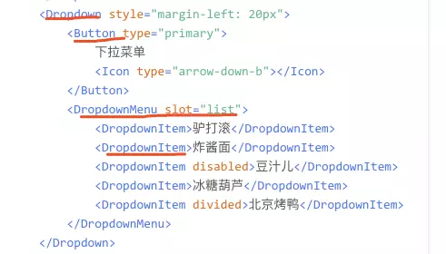
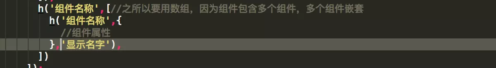

## iview表格table中，如何添加Dropdown 下拉菜单

在iview中Table表格中有一个列描述数据对象（render），render是 columns 中的一项，自定义渲染列，使用 Vue 的 Render 函数。传入两个参数，第一个是 h，第二个为对象，包含 row、column 和 index，分别指当前行数据，当前列数据，当前行索引。

当然官网提供一个简单的使用方法：[iView - A high quality UI Toolkit based on Vue.js](https://www.iviewui.com/components/table)

现在我们来实现，添加一个Dropdown 下拉菜单：

这里要注意下我描述的，1，2，3，4点，先不急，咱们先看下官网这个Dropdown组件

不难看出，讲一个组件写成render其实很简单，只需要写成这样

最后就是要注意下，绑定事件了，这里的on要写成nativeOn，才可以出发事件。