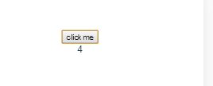
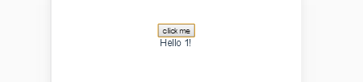
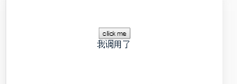
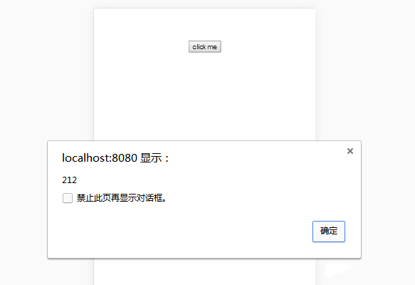
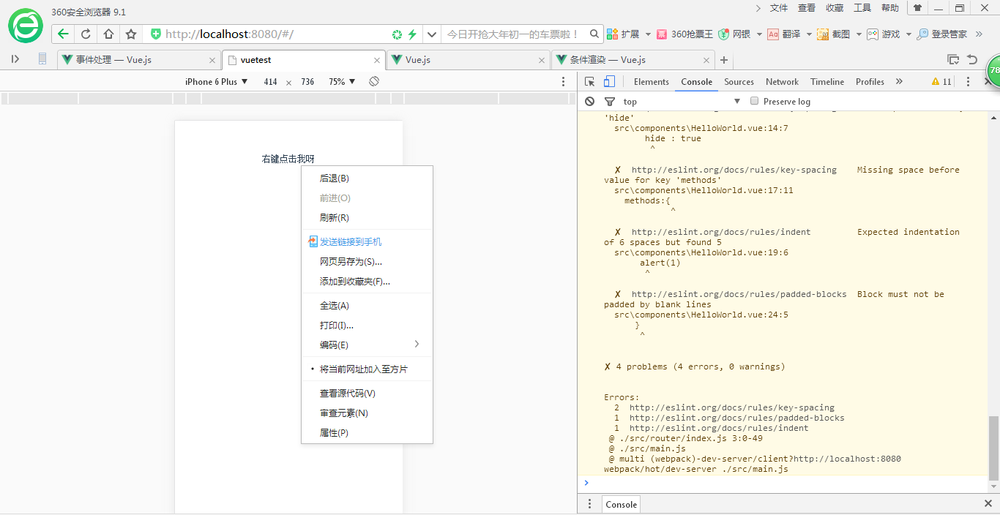

## vue常用事件之v-on:click 以及事件对象，事件冒泡，事件默认行为

其实v-on后面跟的不止是click事件也可以是其他的事件，用法均相似。比如：v-on:click/mouseout/mouseover/mousedown.......

以下click为例

注意：所有的v-on都可以简写为@，比如说v-click可以简写为@click

- 1.监听事件
可以用 `v-on` 指令监听 DOM 事件，并在触发时运行一些 JavaScript 代码。通常来讲就是监听dom触发一些操作，这些操作（比如点击）触发后执行的动作（js）可有直接写在后面
```
v-on:click="item+=1"
```
eg:
```
<template>
  <div >
   <input type="button" value="clickme" v-on:click="item+=1"/>
    <div>{{item}}</div>
  </div>
</template>
 
<script>
export default {
  name: 'HelloWorld',
  data () {
    return {
    item:1
    }
  }
}
</script>
 
<!-- Add "scoped" attribute to limit CSS to this component only -->
<style scoped>
 
</style>
```
结果：



可以看见每点击一次绑定的值就增加1.也就是说可以吧js的操作放在事件触发的后面。但是有时候逻辑太复杂的时候写在里面就会造成混乱，视图和逻辑混淆。所以click后面可以接一个方法，把所有处理逻辑的方法封装在一个函数里面click的时候调用

- 2.事件处理方法
```
v-on:click="greet"
```
eg;
```
<template>
  <div >
   <input type="button" value="clickme" v-on:click="greet"/>
    <div>{{res}}</div>
  </div>
</template>
 
<script>
export default {
  name: 'HelloWorld',
  data () {
    return {
      name : 1,
      res:""
    }
  },
  methods:{
    greet: function () {
      // `this` 在方法里指向当前 Vue 实例
      this.res='Hello ' + this.name + '!';
    }
  }
}
</script>
 
<!-- Add "scoped" attribute to limit CSS to this component only -->
<style scoped>
 
</style>
```
效果：



可以看见点击之后执行了greet方法里面js逻辑

- 3.带参数的时间绑定方法：
同上，唯一区别是携带了参数
```
 v-on:click="greet(name)"
```
```
<template>
  <div >
   <input type="button" value="clickme" v-on:click="greet(name)"/>
    <div>{{res}}</div>
  </div>
</template>
 
<script>
export default {
  name: 'HelloWorld',
  data () {
    return {
      name : 1,
      res:""
    }
  },
  methods:{
    greet: function (reccept) {
      // `this` 在方法里指向当前 Vue 实例
      this.res='Hello ' + reccept+1 + '!';
    }
  }
}
</script>
 
<!-- Add "scoped" attribute to limit CSS to this component only -->
<style scoped>
 
</style>
```
效果一致。对方法的调用同样可以一个方法多处多次的调用

- 4.内联处理器中的方法
也就是说在方法里面调用其他的方法,这里的其他方法可以是js原生的方法比如阻止冒泡呀等等，也可以是自定义的方法
```
v-on:click="greet(name,$event)"
```
eg:
```
<template>
  <div >
   <input type="button" value="clickme" v-on:click="greet(name,$event)"/>
    <div>{{res}}</div>
  </div>
</template>
 
<script>
export default {
  name: 'HelloWorld',
  data () {
    return {
      name : 1,
      res:""
    }
  },
  methods:{
    greet: function (reccept,event) {
      if (reccept===1) this.say()
    },
    say:function () {
      this.res="我调用了"
    }
  }
}
</script>
 
<!-- Add "scoped" attribute to limit CSS to this component only -->
<style scoped>
 
</style>
```
效果：



- 5.事件对象
$event 拿到当前点击事件的事件对象，比如click就是拿到当前点击的dom事件对象信息
```
v-on:click="greet($event)"
```
eg:
```
<template>
  <div >
   <input type="button" value="clickme" v-on:click="greet($event)"/>
  </div>
</template>
 
<script>
export default {
  name: 'HelloWorld',
  data () {
    return {
      hide : true
    }
  },
  methods:{
    greet: function (ev) {
    alert(ev.clientX)
    }
  }
}
</script>
 
<!-- Add "scoped" attribute to limit CSS to this component only -->
<style scoped>
 
</style>
```
效果：



- 6.事件冒泡
当不阻止事件冒泡的时候会弹两次

eg
```
<template>
  <div >
    <div @click="show1($event)">
      <div @click="show2($event)">点击我呀</div>
    </div>
  </div>
</template>
 
<script>
export default {
  name: 'HelloWorld',
  data () {
    return {
      hide : true
    }
  },
  methods:{
    show1: function (ev) {
     alert(1)
    },
    show2: function (ev1) {
      alert(2)
    }
  }
}
</script>
 
<!-- Add "scoped" attribute to limit CSS to this component only -->
<style scoped>
 
</style>
```
那么但阻止冒泡后就只会弹一次

eg:原生js阻止冒泡
```
    ev1.cancelBubble=true
```
```
<template>
  <div >
    <div @click="show1($event)">
      <div @click="show2($event)">点击我呀</div>
    </div>
  </div>
</template>
 
<script>
export default {
  name: 'HelloWorld',
  data () {
    return {
      hide : true
    }
  },
  methods:{
    show1: function (ev) {
     alert(1)
    },
    show2: function (ev1) {
        ev1.cancelBubble=true
      alert(2)
 
    }
  }
}
</script>
 
<!-- Add "scoped" attribute to limit CSS to this component only -->
<style scoped>
 
</style>
```
那么vue自己封装的阻止冒泡方法呢？
```
@click.stop="show2()"
eg:
<template>
  <div >
    <div @click="show1()">
      <div @click.stop="show2()">点击我呀</div>
    </div>
  </div>
</template>
 
<script>
export default {
  name: 'HelloWorld',
  data () {
    return {
      hide : true
    }
  },
  methods:{
    show1: function () {
     alert(1)
    },
    show2: function (ev1) {
      alert(2)
    }
  }
}
</script>
 
<!-- Add "scoped" attribute to limit CSS to this component only -->
<style scoped>
 
</style>
```
- 7.阻止默认行为：
比如：如下右键之后会将默认的菜单带出来
```
<template>
  <div >
    <div>
      <div @contextmenu="show2()">右键点击我呀</div>
    </div>
  </div>
</template>
 
<script>
export default {
  name: 'HelloWorld',
  data () {
    return {
      hide : true
    }
  },
  methods:{
    show2: function (ev1) {
      alert(2)
 
    }
  }
}
</script>
 
<!-- Add "scoped" attribute to limit CSS to this component only -->
<style scoped>
 
</style>
```
效果：



那么就有了阻止默认行为
```
 ev1.preventDefault();
```
eg:
```
<template>
  <div >
    <div>
      <div @contextmenu="show2($event)">右键点击我呀</div>
    </div>
  </div>
</template>
 
<script>
export default {
  name: 'HelloWorld',
  data () {
    return {
      hide : true
    }
  },
  methods:{
    show2: function (ev1) {
      alert(2);
      ev1.preventDefault();
    }
  }
}
</script>
 
<!-- Add "scoped" attribute to limit CSS to this component only -->
<style scoped>
 
</style>
```
点击后默认菜单将不会显示（PS早360浏览器右键无效）
vue里面的封装的阻止默认行为的方法：
```
@contextmenu.prevent="show2()"
```
eg:
```
<template>
  <div >
    <div>
      <div @contextmenu.prevent="show2()">右键点击我呀</div>
    </div>
  </div>
</template>
 
<script>
export default {
  name: 'HelloWorld',
  data () {
    return {
      hide : true
    }
  },
  methods:{
    show2: function (ev1) {
      alert(2);
    }
  }
}
</script>
 
<!-- Add "scoped" attribute to limit CSS to this component only -->
<style scoped>
 
</style>
```
- 8.其他事件修饰符

用法都一样就不再赘述

- .capture
- .self
- .once
```
<!-- 阻止单击事件继续传播 -->
<a v-on:click.stop="doThis"></a>

<!-- 提交事件不再重载页面 -->
<form v-on:submit.prevent="onSubmit"></form>

<!-- 修饰符可以串联 -->
<a v-on:click.stop.prevent="doThat"></a>

<!-- 只有修饰符 -->
<form v-on:submit.prevent></form>

<!-- 添加事件监听器时使用事件捕获模式 -->
<!-- 即元素自身触发的事件先在此处处理，然后才交由内部元素进行处理 -->
<div v-on:click.capture="doThis">...</div>

<!-- 只当在 event.target 是当前元素自身时触发处理函数 -->
<!-- 即事件不是从内部元素触发的 -->
<div v-on:click.self="doThat">...</div>
```
使用修饰符时，顺序很重要；相应的代码会以同样的顺序产生。因此，用 @click.prevent.self 会阻止所有的点击，而 @click.self.prevent 只会阻止对元素自身的点击。

> 2.1.4 新增
```
<!-- 点击事件将只会触发一次 -->
<a v-on:click.once="doThis"></a>
```

不像其它只能对原生的 DOM 事件起作用的修饰符，.once 修饰符还能被用到自定义的组件事件上。如果你还没有阅读关于组件的文档，现在大可不必担心。

```
<!-- the scroll event will not cancel the default scroll behavior -->
<div v-on:scroll.passive="onScroll">...</div>
```
Vue 为这些修饰符额外提供了 .passive 修饰符来提升移动端的性能。举个例子，在滚动的时候，浏览器会在整个事件处理完毕之后再触发滚动，因为浏览器并不知道这个事件是否在其处理函数中被调用了 event.preventDefault()。.passive 修饰符用来进一步告诉浏览器这个事件的默认行为不会被取消。

> 不要把 .passive 和 .prevent 一起使用。被动处理函数无法阻止默认的事件行为。