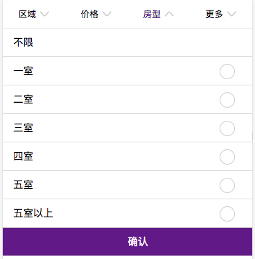
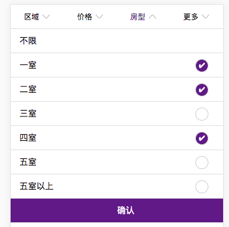

## vue中传多选项数据到后台（判断数组中是否存在该项，存在则删除，不存在则添加）

先看一下要实现的目标。如下图所示，一室、二室.....五室以上为可选项，及点一次选中它，再点为取消。最后选完后，点确定时，带着选中的参数到后台请求数据。



要实现这样的功能，简单点来说，可以利用JavaScript提供的方法。
```
if (this.bedroomNum.indexOf(id) === -1) {
  this.bedroomNum.push(id)
} else {
  this.bedroomNum.splice(this.bedroomNum.indexOf(id), 1)
}
```
通过indexOf(id)判断这个选中的id是否在bedroomNum数组中存在，如果不存在会返回-1,则通过push将这个id添加到这个数组中。否则就是存在的，通过splice(这个id在数组中的索引，1)删除。
来看一些VUE中具体的实现代码：

html结构中：
```
<ul class="searchType_bedroom" v-if="searchType === 2">
  <li @click="allBedroom">不限</li>
  <li v-for="item in bedroom" @click="change_bedroom(item.bedroom)">{{item.name}}<span :class="bedroomNum.indexOf(item.bedroom) !== -1 ? 'isSelect' : '' ">✔</span></li>
  <li class="submit" @click="submitBedroon">确认</li>
</ul>
```
vue data () 中：
```
bedroom: [{name: '一室', bedroom: '1'},
  {name: '二室', bedroom: '2'}, {name: '三室', bedroom: '3'},
  {name: '四室', bedroom: '4'}, {name: '五室', bedroom: '5'},
  {name: '五室以上', bedroom: ''}],
```
vue methods方法中：
```
change_bedroom (id) {
  if (this.bedroomNum.indexOf(id) === -1) {
    this.bedroomNum.push(id)
  } else {
    this.bedroomNum.splice(this.bedroomNum.indexOf(id), 1)
  }
},
```
最终结果，点击选中，再点击取消。bedroom中保存选中的数据。
