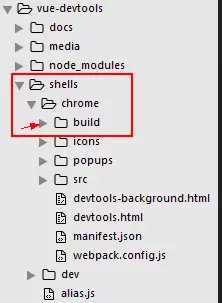
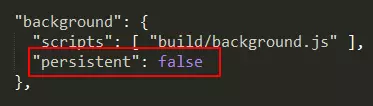
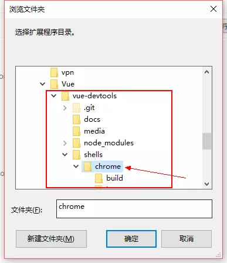
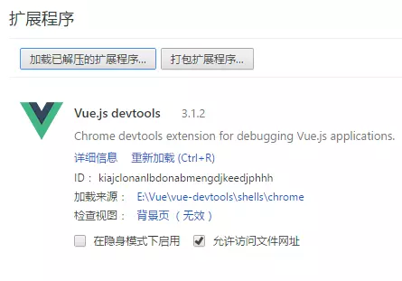
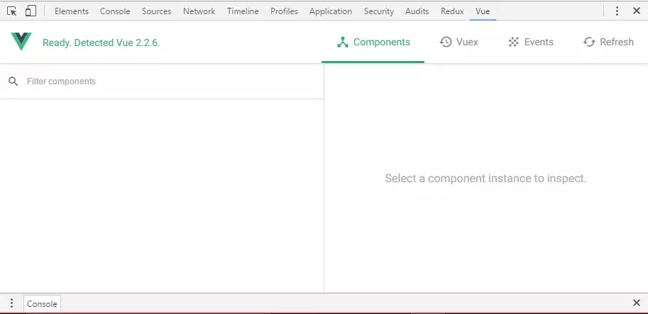

# 解决vue-devtools在Chrome中无效问题终极方案

如果你使用了chrome安装了vue的chrome扩展程序vue-devtools(集成了vuex工具)，然后在开发环境中使用，你会发现使用时F12查看开发者工具，发现并没有什么卵用，vue面板依然没有出现。
百度一搜，基本上是说manifest.json将其中的一个参数persistent改为true就好，但是仍然没有出现vue面板。

解决方案

**step1**

克隆
```
$ git clone https://github.com/vuejs/vue-devtools.git
```

安装
```
$ cd vue-devtools && yarn install
```

编译
```
$ npm run build
```

此时就可以查看代码目录：vue-devtools/shells/chrome/下多了一个目录build。



**step2**

照着网上找到的方案，此步就是修改manifest.json，将其中的一个参数persistent修改为true



**step3**

打开chrome找到选项中的 更多工具 / 扩展程序 选项，勾选 开发者模式，然后点击 加载已解压的扩展程序


找到我们的目录：



确定之后，可以看到已经加载了我们的vue-devtools扩展程序了。



这时，你可以在你写的demo中查看。依然是没有vue面板的。
上面的步骤都是与网上的方式是一模一样的。

**step4**

实际上，上面的方法已经解决了问题。不过要想面板出现，必须在vue的生产环境下使用。
至于生产环境的布署给个webpack.config.js的实现方式：
```
// 省略主配置逻辑...
if (process.env.NODE_ENV === 'production') {
    module.exports.devtool = '#source-map'
    // http://vue-loader.vuejs.org/en/workflow/production.html
    module.exports.plugins = (module.exports.plugins || []).concat([
        new webpack.DefinePlugin({
            'process.env': {
                NODE_ENV: JSON.stringify('production')
            }
        }),
        new webpack.optimize.UglifyJsPlugin({
            sourceMap: true,
            compress: {
                warnings: false
            }
        }),
        new webpack.LoaderOptionsPlugin({
            minimize: true
        })
    ])
}
```
然后配置一下package.json的scripts项：
```
"scripts": {
    "dev": "cross-env NODE_ENV=development webpack-dev-server --hot",
    "build": "cross-env NODE_ENV=production webpack --progress --hide-modules"
  }
```
当然，我们也不是要在开发阶段都要每一步都得去实现编译成生产环境。
官方推荐我们使用一个配置的办法，即在我们的项目入口文件添加一个配置项：
```
Vue.config.devtools = true;
```
这时查看应该就有了vue面板了。
如果还是没有。我们可以将url添加一个配置参数：CSP-environments，就可以了。
则在http://localhost:8080中添加一个参数#CSP-environments就可以解决这个问题，即为：http://localhost:8080#CSP-environments
这时，刷新如果仍然没有。请先关闭掉开发者工具(F12)，然后再打开一次F12。这里就可以看到vue面板了！大功告成！

