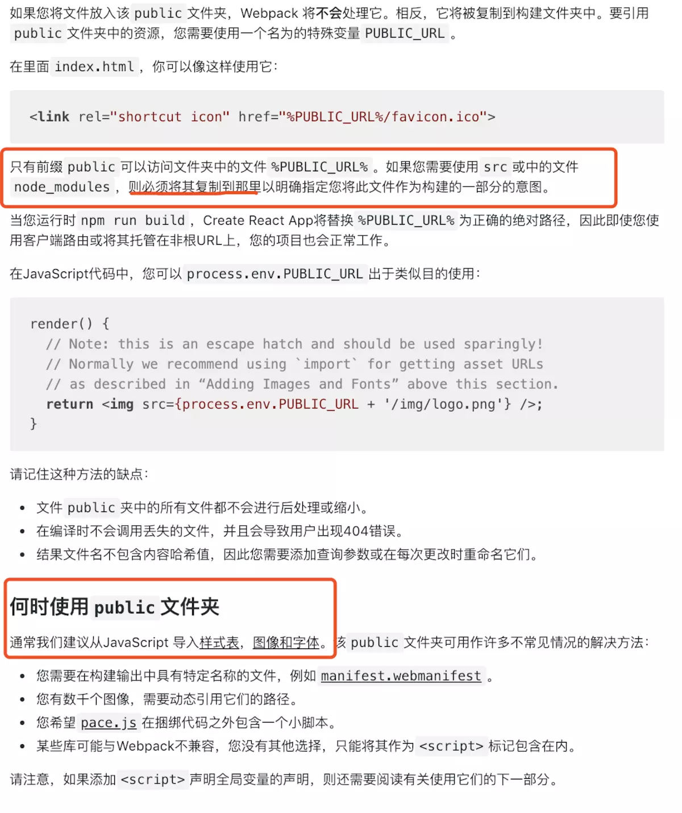
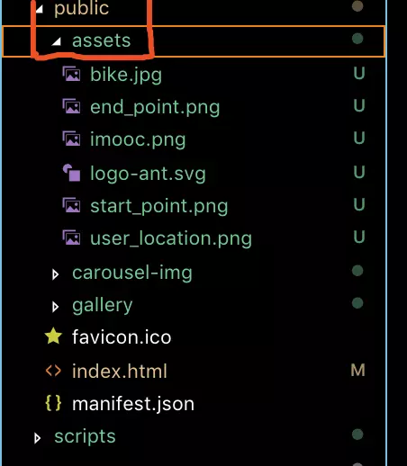

用create-react-app脚手架搭建react项目:`npx create-react-app demoname`

1. 如果图片放在了src下的assets的img文件夹中，这种情况下直接用src会出现问题，但是用require是可以的

```html

```
**注意：require中只能放字符串，不能放变量**

后来看了看create-react-app的官网，官网明确说出最好将图片样式等放在public文件夹中，是可以用的``这种形式的
如下图官网 [https://facebook.github.io/create-react-app/docs/using-the-public-folder#when-to-use-the-public-folde](https://facebook.github.io/create-react-app/docs/using-the-public-folder#when-to-use-the-public-folder)



改装后的文件夹如下，将图片放在了public文件夹中：

这样就可以用了
```html

```

2. 图片存放于assets文件夹下时
```js
// 引入方式方式1
import logo from '@/assets/images/logo.png';

// 引入方式方式2
const logo = require('@/assets/images/logo.png');
```
render中使用
```

<div style={{ background: `url(${logo}) no-repeat center` }}>背景图</div>
```

```
// 不用引入，直接行内引入路径

```
**注意：require中只能放字符串，不能放变量**