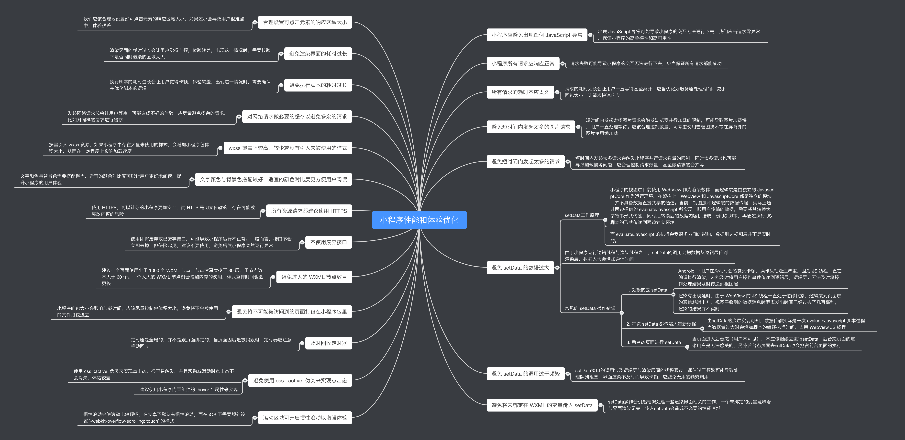

# 小程序性能和体验优化方法

## 小程序应避免出现任何 JavaScript 异常

- 出现 `JavaScript` 异常可能导致小程序的交互无法进行下去，我们应当追求零异常，保证小程序的 [高鲁棒性](https://baike.baidu.com/item/%E9%B2%81%E6%A3%92%E6%80%A7/832302?fr=aladdin) 和高可用性

## 小程序所有请求应响应正常

- 请求失败可能导致小程序的交互无法进行下去，应当保证所有请求都能成功

## 所有请求的耗时不应太久

- 请求的耗时太长会让用户一直等待甚至离开，应当优化好服务器处理时间、减小回包大小，让请求快速响应

## 避免短时间内发起太多的图片请求

短时间内发起太多图片请求会触发浏览器并行加载的限制，可能导致图片加载慢，用户一直处理等待。应该合理控制数量，可考虑使用雪碧图技术或在屏幕外的图片使用懒加载

## 避免短时间内发起太多的请求

- 短时间内发起太多请求会触发小程序并行请求数量的限制，同时太多请求也可能导致加载慢等问题，应合理控制请求数量，甚至做请求的合并等

## 避免 `setData` 的数据过大

### setData工作原理

- 小程序的视图层目前使用 `WebView` 作为渲染载体，而逻辑层是由独立的 `JavascriptCore` 作为运行环境。在架构上，`WebView` 和 `JavascriptCore` 都是独立的模块，并不具备数据直接共享的通道。当前，视图层和逻辑层的数据传输，实际上通过两边提供的 `evaluateJavascript` 所实现。即用户传输的数据，需要将其转换为字符串形式传递，同时把转换后的数据内容拼接成一份 `JS` 脚本，再通过执行 `JS` 脚本的形式传递到两边独立环境。
- 而 `evaluateJavascript` 的执行会受很多方面的影响，数据到达视图层并不是实时的。
- 由于小程序运行逻辑线程与渲染线程之上，`setData` 的调用会把数据从逻辑层传到渲染层，数据太大会增加通信时间

### 常见的 `setData` 操作错误

1. 频繁的去 `setData`

- `Android` 下用户在滑动时会感觉到卡顿，操作反馈延迟严重，因为 `JS` 线程一直在编译执行渲染，未能及时将用户操作事件传递到逻辑层，逻辑层亦无法及时将操作处理结果及时传递到视图层
- 染有出现延时，由于 `WebView` 的 `JS` 线程一直处于忙碌状态，逻辑层到页面层的通信耗时上升，视图层收到的数据消息时距离发出时间已经过去了几百毫秒，渲染的结果并不实时

2. 每次 `setData` 都传递大量新数据

- 由 `setData` 的底层实现可知，数据传输实际是一次 `evaluateJavascript` 脚本过程，当数据量过大时会增加脚本的编译执行时间，占用 `WebView JS` 线程

3. 后台态页面进行 `setData`

- 当页面进入后台态（用户不可见），不应该继续去进行 `setData` ，后台态页面的渲染用户是无法感受的，另外后台态页面去 `setData` 也会抢占前台页面的执行

### 避免 `setData` 的调用过于频繁

- `setData` 接口的调用涉及逻辑层与渲染层间的线程通过，通信过于频繁可能导致处理队列阻塞，界面渲染不及时而导致卡顿，应避免无用的频繁调用

### 避免将未绑定在 `WXML` 的变量传入 `setData`

- `setData` 操作会引起框架处理一些渲染界面相关的工作，一个未绑定的变量意味着与界面渲染无关，传入 `setData` 会造成不必要的性能消耗

## 合理设置可点击元素的响应区域大小

- 我们应该合理地设置好可点击元素的响应区域大小，如果过小会导致用户很难点中，体验很差

## 避免渲染界面的耗时过长

- 渲染界面的耗时过长会让用户觉得卡顿，体验较差，出现这一情况时，需要校验下是否同时渲染的区域太大

## 避免执行脚本的耗时过长

- 执行脚本的耗时过长会让用户觉得卡顿，体验较差，出现这一情况时，需要确认并优化脚本的逻辑

## 对网络请求做必要的缓存以避免多余的请求

- 发起网络请求总会让用户等待，可能造成不好的体验，应尽量避免多余的请求，比如对同样的请求进行缓存

## `wxss` 覆盖率较高，较少或没有引入未被使用的样式

- 按需引入 `wxss` 资源，如果小程序中存在大量未使用的样式，会增加小程序包体积大小，从而在一定程度上影响加载速度

## 文字颜色与背景色搭配较好，适宜的颜色对比度更方便用户阅读

- 文字颜色与背景色需要搭配得当，适宜的颜色对比度可以让用户更好地阅读，提升小程序的用户体验

## 所有资源请求都建议使用 HTTPS

- 使用 `HTTPS`，可以让你的小程序更加安全，而 `HTTP` 是明文传输的，存在可能被篡改内容的风险

## 不使用废弃接口

- 使用即将废弃或已废弃接口，可能导致小程序运行不正常。一般而言，接口不会立即去掉，但保险起见，建议不要使用，避免后续小程序突然运行异常

## 避免过大的 `WXML` 节点数目

- 建议一个页面使用少于 `1000` 个 `WXML` 节点，节点树深度少于 `30` 层，子节点数不大于 `60` 个。一个太大的 `WXML` 节点树会增加内存的使用，样式重排时间也会更长

## 避免将不可能被访问到的页面打包在小程序包里

- 小程序的包大小会影响加载时间，应该尽量控制包体积大小，避免将不会被使用的文件打包进去

## 及时回收定时器

定时器是全局的，并不是跟页面绑定的，当页面因后退被销毁时，定时器应注意手动回收

## 避免使用 `css ':active'` 伪类来实现点击态

- 使用 `css ':active'` 伪类来实现点击态，很容易触发，并且滚动或滑动时点击态不会消失，体验较差
- 建议使用小程序内置组件的 `'hover-*'` 属性来实现

## 滚动区域可开启惯性滚动以增强体验

- 惯性滚动会使滚动比较顺畅，在安卓下默认有惯性滚动，而在 `iOS` 下需要额外设置 `-webkit-overflow-scrolling: touch` 的样式
