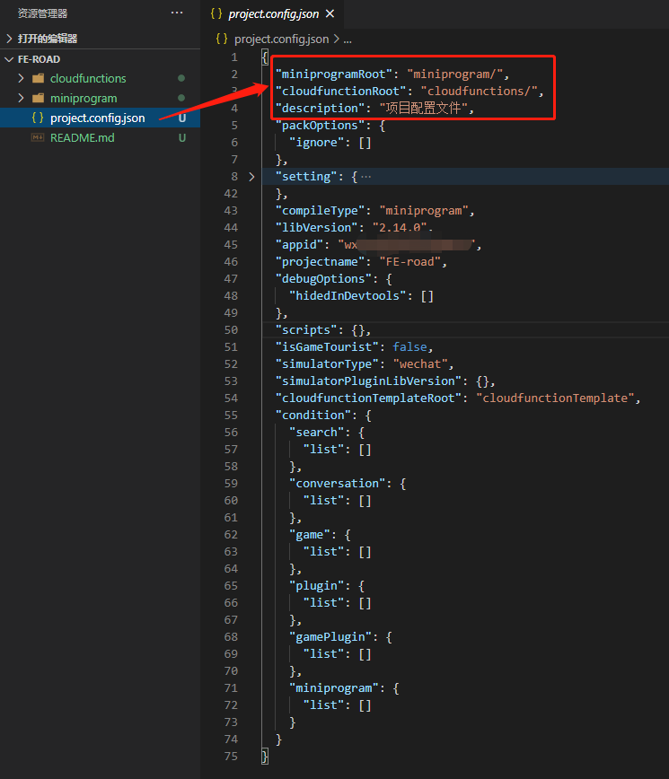
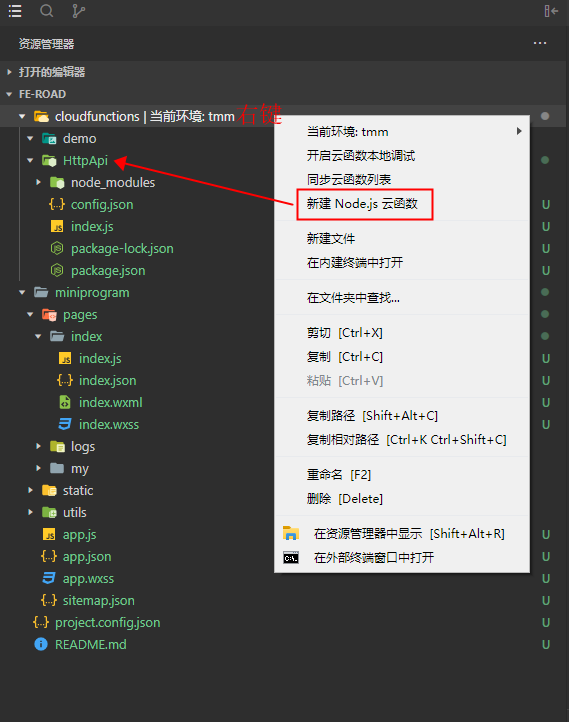
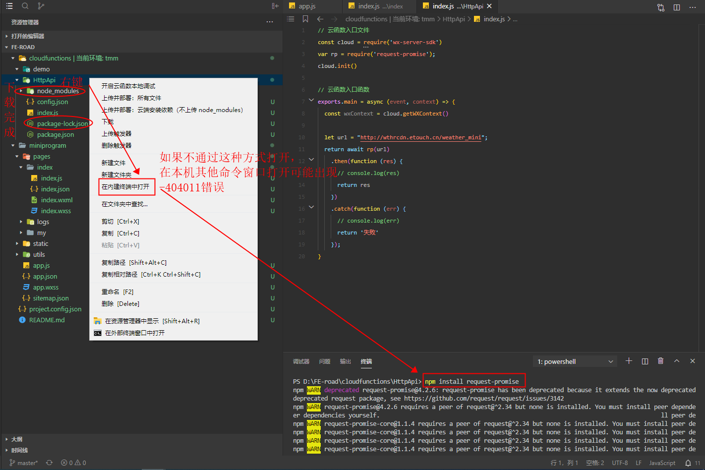
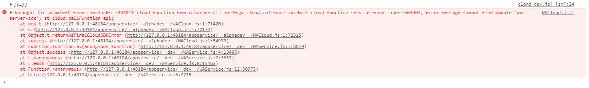
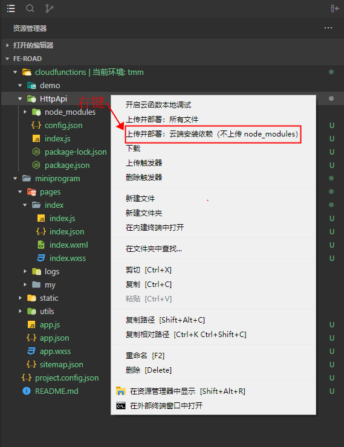

# 微信小程序 通过云函数请求http网站接口

> 微信小程序正式版无法调用 `http` 类型的 `API` 接口，只有 `htttps` 类型才可以通过验证，可以利用云函数避免这一难点。

1. 新建 `cloudfunctions` 文件夹，`project.config.json` 配置根目录

    

2. 在 `cloudfunctions` 文件夹右击，新建 `HttpApi` 云函数

    

3. 使用云函数前，`HttpApi` 文件夹 右击 在内建终端中打开，安装这个命令：`npm install request-promise`，
安装完成后文件夹内多了 `node_modules` 文件夹、`package-lock.json` 文件
    

    **特别注意：如果在本机其他窗口打开终端，可能会出现如下 `-404011` 错误(SDK 云函数错误：云函数调用失败：函数执行失败)**
    参考：[错误码](https://developers.weixin.qq.com/miniprogram/dev/wxcloud/reference/errcode.html)

    

4. 编辑 云函数入口文件 `cloudfunctions\HttpApi\index.js`

```js
// 云函数入口文件
const cloud = require('wx-server-sdk')
var rp = require('request-promise');
cloud.init()

// 云函数入口函数
exports.main = async (event, context) => {
  const wxContext = cloud.getWXContext()
  // 天气预报公共开放接口 http://wthrcdn.etouch.cn/weather_mini?city=北京
  let url = "http://wthrcdn.etouch.cn/weather_mini";
  return await rp(url)
    .then(function (res) {
      return res
    })
    .catch(function (err) {
      return '失败'
    });
}
```

5. 上传并部署云函数(如果不行，可试点击 **上传并部署：所有文件**)

    

6. `miniprogram\app.js` 文件中初始化云函数并设置环境(`env` : 云开发 -> 设置 -> 环境ID)

```js
// app.js
App({
  onLaunch: function () {
    if (!wx.cloud) {
      console.error('请使用 2.2.3 或以上的基础库以使用云能力')
    } else {
      wx.cloud.init({
        // env 参数说明：
        //   env 参数决定接下来小程序发起的云开发调用（wx.cloud.xxx）会默认请求到哪个云环境的资源
        //   此处请填入环境 ID, 环境 ID 可打开云控制台查看
        //   如不填则使用默认环境（第一个创建的环境）
        //   env: 'my-env-id',
        env: 'tmm-0gx0rwuf0b2286eb',
        traceUser: true,
      })
    }
    this.globalData = {}
  }
})
```

7. 前端页面调用云函数 `miniprogram\pages\index\index.js`

```js
// 自定义方法
getCloudData: function (e) {
    console.log(e);
     //调用云函数
     wx.cloud.callFunction({
      // 云函数名称
      name: 'HttpApi',
      // 传给云函数的参数
      data: {
        city: this.data.city
      },
      success: function(res) {
        console.log('成功')
        console.log(res.result)
        //将返回的值转为json格式
        var p = JSON.parse(res.result)
        console.log(p)
        console.log(p.result)
        // var that = this;
        // that.setData({
        // })
      },
      fail: console.error
    })
  }
```

8. 页面调用

```js
<!--pages/index/index.wxml-->
<view>
  <view id="outest">
    <view id="search">
      <!-- <input class="text" type="text" name="" bindinput="bindKeyInput" value="{{city}}" placeholder="请输入城市名" /> -->
      <picker mode="region" bindchange="bindRegionChange" value="{{region}}" custom-item="{{customItem}}" class="text">
        <view>{{city}}</view>
      </picker>
      <view class="btn" bindtap="getCloudData">查询</view>
    </view>
    <view id="cityandtime">
      <view class="info">
        <view>城市：<text class="color5ed">{{wthrcdnData.city}}</text></view>
        <view>日期：<text class="color5ed">{{today}}</text></view>
        <view>当前温度：<text class="color5ed">{{wthrcdnData.wendu}} ℃</text></view>
      </view>
      <view class="list">
        <h5>未来一周气象</h5>
        <ul>
          <li wx:for="{{wthrcdnData.forecast}}" wx:key="index" id="{{'now'+index}}">
            <image src="{{item.url || '../../static/images/icon/0.png'}}" alt=""></image>
            <view class="content">
              <view class="t">{{item.date}} · {{item.type}}</view>
              <view class="b">风向：{{item.fengxiang}} 风力：{{item.fengli}}</view>
            </view>
            <view class="wendu">{{item.high}}/{{item.low}}</view>
          </li>
        </ul>
      </view>
      <view class="tips">温馨提醒：{{wthrcdnData.ganmao}}</view>
    </view>
  </view>
</view>
```

```css
/* pages/index/index.wxss */
#outest {
  padding: 10px;
}
#search {
  display: flex;
  justify-content: space-between;
}
#search .text, #search .btn {
  display: inline-block;
  height: 36px;
  line-height: 36px;
  padding: 0 10px;
  border: 1px solid #2165ed;
  border-radius: 20px;
}
#search .text {
  width: 100%;
  overflow: hidden;
  padding: 0 15px;
}
#search .btn {
  width: 80px;
  color: #fff;
  background-color: #2165ed;
  margin-left: 10px;
  text-align: center;
}
.list {
  display: block;
}
.list h5 {
  font-size: 20px;
  margin-top: 10px;
}
.list ul {
  display: block;
  padding: 0 10px;
}
.list li, .info view {
  width: 100%;
  display: flex;
  justify-content: space-between;
  margin: 16px 0;
}
.info view {
  margin: 10px 0;
}
.list li image {
  display: inline-block;
  width: 45px;
  height: 45px;
}
.list li image, .wendu {
  flex-shrink: 0;
}
.list li .content {
  width: 100%;
  padding: 0 10px;
}
.list li .content .t {
  color: #666;
  font-size: 18px;
}
.list li .content .b, .tips {
  font-size: 14px;
  color: rgba(0, 0, 0, 0.38);
  margin-top: 5px;
}
#now1, #now1 .t {
  color: #2165ed;
}
.color5ed {
  color: #2165ed;
}
```

## 解决返回值乱码问题(参考：[在云函数里做http请求，返回的中文是乱码](https://developers.weixin.qq.com/community/develop/doc/000e8c989704b84bed89048535bc00?jumpto=comment&commentid=000060c43ac860dce289ba1b0568))

1. 编辑 云函数入口文件 `cloudfunctions\HttpApi\index.js`

```js
// 云函数入口文件
const cloud = require('wx-server-sdk')
var rp = require('request-promise');

const jsdom = require('jsdom');
const { JSDOM } = jsdom;
const { window } = new JSDOM();
const { document } = (new JSDOM('')).window;
global.document = document;
const jQuery = require('jquery')(window);

cloud.init()

// 云函数入口函数
exports.main = async (event, context) => {
  const wxContext = cloud.getWXContext()

  let url = "http://wthrcdn.etouch.cn/weather_mini?city=" + (event.city || '');
  return new Promise((rs, rj) => {
    try {
      jQuery.get(url, (res) => {
        rs(res)
      })
    } catch (e) {
      rj(e.message);
    }
  })
  // return await rp(url)
  //   .then(function (res) {
  //     return res
  //   })
  //   .catch(function (err) {
  //     return '失败'
  //   });
}
```

2. 前端页面调用云函数 `miniprogram\pages\index\index.js`

```js
getCloudData: function (e) {
    console.log(e);
    let _this = this;
     //调用云函数
     wx.cloud.callFunction({
      // 云函数名称
      name: 'HttpApi',
      // 传给云函数的参数
      data: {
        city: this.data.city // 参数如果不支持中文可转码 encodeURI(this.data.city)
      },
      success: function(res) {
        console.log(res)
        //将返回的值转为json格式
        let result = JSON.parse(res.result);
        console.log(result);
        if (!result || String(result) == '{}') return
        if (result.status == 1000) {
          let arr = result.data;
          let weatherArr = [
            {text: '未知', pic: 0},
            {text: '晴', pic: 1},
            {text: '多云', pic: 2},
            {text: '阴', pic: 3},
            {text: '阵雨', pic: 4},
            {text: '小雨', pic: 4},
            {text: '中雨', pic: 5},
            {text: '大雨', pic: 6},
            {text: '暴雨', pic: 7},
            {text: '阵雪', pic: 8},
            {text: '小雪', pic: 8},
            {text: '中雪', pic: 9},
            {text: '大雪', pic: 10},
            {text: '暴雪', pic: 11},
            {text: '雾', pic: 12},
            {text: '霾', pic: 12},
          ];
          arr.yesterday.fengli = arr.yesterday.fl;
          arr.yesterday.fengxiang = arr.yesterday.fx;
          arr.forecast.unshift(arr.yesterday);
          arr.forecast.forEach((item, index) => {
            arr.forecast[index].high = item.high.substring(3);
            arr.forecast[index].low = item.low.substring(3);
            item.date = Number(item.date.split('日')[0]) < 10 ? '0' + item.date : item.date;
            item.fengli = item.fengli.replace('<![CDATA[', '').replace(']]>', '');
            arr.forecast[index].date = item.date.replace('日', '日：');
            weatherArr.forEach((it, ind) => {
              if (item.type.indexOf(it.text) > -1) {
                item.url = `../../static/images/icon/${it.pic}.png`;
              }
            })
          })
          _this.setData({
            wthrcdnData: arr
          });
        } else {
          wx.showToast({
            title: result.desc,
            icon: 'none',
            duration: 3000
          })
        }
      },
      fail: console.error
    })
  }
```

相关网址：[云开发 HTTP API 文档](https://developers.weixin.qq.com/miniprogram/dev/wxcloud/reference-http-api/)
